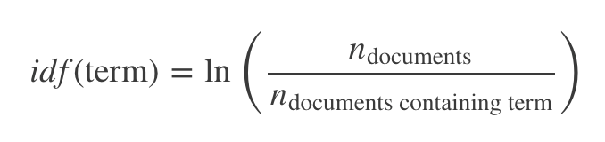
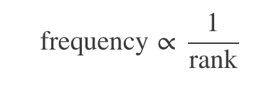

A central question in text mining and natural language processing is how to quantify what a document is about. Can we do this by looking at the words that make up the document? One measure of how important a word may be is its term frequency (tf), how frequently a word occurs in a document, as we examined in Chapter 1. There are words in a document, however, that occur many times but may not be important; in English, these are probably words like “the”, “is”, “of”, and so forth. We might take the approach of adding words like these to a list of stop words and removing them before analysis, but it is possible that some of these words might be more important in some documents than others. A list of stop words is not a very sophisticated approach to adjusting term frequency for commonly used words.

Another approach is to look at a term’s inverse document frequency (idf), which decreases the weight for commonly used words and increases the weight for words that are not used very much in a collection of documents. This can be combined with term frequency to calculate a term’s tf-idf (the two quantities multiplied together), the frequency of a term adjusted for how rarely it is used.

The statistic tf-idf is intended to measure how important a word is to a document in a collection (or corpus) of documents, for example, to one novel in a collection of novels or to one website in a collection of websites.

It is a rule-of-thumb or heuristic quantity; while it has proved useful in text mining, search engines, etc., its theoretical foundations are considered less than firm by information theory experts. The inverse document frequency for any given term is defined as



We can use tidy data principles, as described in Chapter 1, to approach tf-idf analysis and use consistent, effective tools to quantify how important various terms are in a document that is part of a collection.

```{r}
library(dplyr)
library(janeaustenr)
library(tidytext)

book_words <- austen_books() %>%
  unnest_tokens(word, text) %>%
  count(book, word, sort = TRUE) %>%
  ungroup()

total_words <- book_words %>% 
  group_by(book) %>% 
  summarize(total = sum(n))

book_words <- left_join(book_words, total_words)

book_words
```

There is one row in this book_words data frame for each word-book combination; n is the number of times that word is used in that book and total is the total words in that book. The usual suspects are here with the highest n, “the”, “and”, “to”, and so forth. In Figure 3.1, let’s look at the distribution of n/total for each novel, the number of times a word appears in a novel divided by the total number of terms (words) in that novel. This is exactly what term frequency is.

```{r}
library(ggplot2)

ggplot(book_words, aes(n/total, fill = book)) +
  geom_histogram(show.legend = FALSE) +
  xlim(NA, 0.0009) +
  facet_wrap(~book, ncol = 2, scales = "free_y")
```

Figure 3.1: Term Frequency Distribution in Jane Austen’s Novels

There are very long tails to the right for these novels (those extremely common words!) that we have not shown in these plots. These plots exhibit similar distributions for all the novels, with many words that occur rarely and fewer words that occur frequently.

# Zipf’s law

Distributions like those shown in Figure 3.1 are typical in language. In fact, those types of long-tailed distributions are so common in any given corpus of natural language (like a book, or a lot of text from a website, or spoken words) that the relationship between the frequency that a word is used and its rank has been the subject of study; a classic version of this relationship is called Zipf’s law, after George Zipf, a 20th century American linguist.

Zipf’s law states that the frequency that a word appears is inversely proportional to its rank.

Since we have the data frame we used to plot term frequency, we can examine Zipf’s law for Jane Austen’s novels with just a few lines of dplyr functions.

```{r}
freq_by_rank <- book_words %>% 
  group_by(book) %>% 
  mutate(rank = row_number(), 
         `term frequency` = n/total)

freq_by_rank
```

The rank column here tells us the rank of each word within the frequency table; the table was already ordered by n so we could use row_number() to find the rank. Then, we can calculate the term frequency in the same way we did before. Zipf’s law is often visualized by plotting rank on the x-axis and term frequency on the y-axis, on logarithmic scales. Plotting this way, an inversely proportional relationship will have a constant, negative slope.

```{r}
freq_by_rank %>% 
  ggplot(aes(rank, `term frequency`, color = book)) + 
  geom_line(size = 1.2, alpha = 0.8) + 
  scale_x_log10() +
  scale_y_log10()
```
Figure 3.2: Zipf’s law for Jane Austen’s novels

Notice that Figure 3.2 is in log-log coordinates. We see that all six of Jane Austen’s novels are similar to each other, and that the relationship between rank and frequency does have negative slope. It is not quite constant, though; perhaps we could view this as a broken power law with, say, three sections. Let’s see what the exponent of the power law is for the middle section of the rank range.

```{r}
rank_subset <- freq_by_rank %>% 
  filter(rank < 500,
         rank > 10)

lm(log10(`term frequency`) ~ log10(rank), data = rank_subset)
```

Classic versions of Zipf’s law have


 
and we have in fact gotten a slope close to -1 here. Let’s plot this fitted power law with the data in Figure 3.3 to see how it looks.

```{r}
freq_by_rank %>% 
  ggplot(aes(rank, `term frequency`, color = book)) + 
  geom_abline(intercept = -0.62, slope = -1.1, color = "gray50", linetype = 2) +
  geom_line(size = 1.2, alpha = 0.8) + 
  scale_x_log10() +
  scale_y_log10()
```

# The bind_tf_idf function

```{r}
book_words <- book_words %>%
  bind_tf_idf(word, book, n)
book_words
```


```{r}
book_words %>%
  select(-total) %>%
  arrange(desc(tf_idf))
```


```{r}
plot_austen <- book_words %>%
  arrange(desc(tf_idf)) %>%
  mutate(word = factor(word, levels = rev(unique(word))))

plot_austen %>% 
  top_n(20) %>%
  ggplot(aes(word, tf_idf, fill = book)) +
  geom_col() +
  labs(x = NULL, y = "tf-idf") +
  coord_flip()
```
Figure 3.4: Highest tf-idf words in Jane Austen’s Novels

Let’s look at the novels individually.

```{r}
plot_austen %>% 
  group_by(book) %>% 
  top_n(15) %>% 
  ungroup %>%
  ggplot(aes(word, tf_idf, fill = book)) +
  geom_col(show.legend = FALSE) +
  labs(x = NULL, y = "tf-idf") +
  facet_wrap(~book, ncol = 2, scales = "free") +
  coord_flip()
```

Figure 3.5: Highest tf-idf words in each of Jane Austen’s Novels

Still all proper nouns in Figure 3.5! These words are, as measured by tf-idf, the most important to each novel and most readers would likely agree. What measuring tf-idf has done here is show us that Jane Austen used similar language across her six novels, and what distinguishes one novel from the rest within the collection of her works are the proper nouns, the names of people and places. This is the point of tf-idf; it identifies words that are important to one document within a collection of documents.

# A corpus of physics texts

Let’s work with another corpus of documents, to see what terms are important in a different set of works. In fact, let’s leave the world of fiction and narrative entirely. Let’s download some classic physics texts from Project Gutenberg and see what terms are important in these works, as measured by tf-idf. Let’s download Discourse on Floating Bodies by Galileo Galilei, Treatise on Light by Christiaan Huygens, Experiments with Alternate Currents of High Potential and High Frequency by Nikola Tesla, and Relativity: The Special and General Theory by Albert Einstein.

This is a pretty diverse bunch. They may all be physics classics, but they were written across a 300-year timespan, and some of them were first written in other languages and then translated to English. Perfectly homogeneous these are not, but that doesn’t stop this from being an interesting exercise!

```{r}
library(gutenbergr)
physics <- gutenberg_download(c(37729, 14725, 13476, 5001), 
                              meta_fields = "author")
```

Now that we have the texts, let’s use unnest_tokens() and count() to find out how many times each word was used in each text.

```{r}
physics_words <- physics %>%
  unnest_tokens(word, text) %>%
  count(author, word, sort = TRUE) %>%
  ungroup()

physics_words
```

Here we see just the raw counts; we need to remember that these documents are all different lengths. Let’s go ahead and calculate tf-idf, then visualize the high tf-id words in Figure 3.6.

```{r}
physics_words <- physics_words %>%
  bind_tf_idf(word, author, n) 

plot_physics <- physics_words %>%
  arrange(desc(tf_idf)) %>%
  mutate(word = factor(word, levels = rev(unique(word)))) %>%
  mutate(author = factor(author, levels = c("Galilei, Galileo",
                                            "Huygens, Christiaan", 
                                            "Tesla, Nikola",
                                            "Einstein, Albert")))

plot_physics %>%
  top_n(20) %>%
  ggplot(aes(word, tf_idf, fill = author)) +
  geom_col() +
  labs(x = NULL, y = "tf-idf") +
  coord_flip()
```

Figure 3.6: Highest tf-idf words in classic physics corpus

Nice! Let’s look at each text individually in Figure 3.7.

```{r}
plot_physics %>% 
  group_by(author) %>% 
  top_n(15, tf_idf) %>% 
  ungroup() %>%
  mutate(word = reorder(word, tf_idf)) %>%
  ggplot(aes(word, tf_idf, fill = author)) +
  geom_col(show.legend = FALSE) +
  labs(x = NULL, y = "tf-idf") +
  facet_wrap(~author, ncol = 2, scales = "free") +
  coord_flip()
```
Figure 3.7: Highest tf-idf words in each physics texts

Very interesting indeed. One thing we see here is “eq” in the Einstein text?!

```{r}
library(stringr)

physics %>% 
  filter(str_detect(text, "eq\\.")) %>% 
  select(text)
```

Some cleaning up of the text may be in order. “K1” is the name of a coordinate system for Einstein:

```{r}
physics %>% 
  filter(str_detect(text, "K1")) %>% 
  select(text)
```

Maybe it makes sense to keep this one. Also notice that in this line we have “co-ordinate”, which explains why there are separate “co” and “ordinate” items in the high tf-idf words for the Einstein text; the unnest_tokens() function separates around punctuation. Notice that the tf-idf scores for “co” and “ordinate” are close to same!

“AB”, “RC”, and so forth are names of rays, circles, angles, and so forth for Huygens.

```{r}
physics %>% 
  filter(str_detect(text, "AK")) %>% 
  select(text)
```

Let’s remove some of these less meaningful words to make a better, more meaningful plot. Notice that we make a custom list of stop words and use anti_join() to remove them; this is a flexible approach that can be used in many situations. We will need to go back a few steps since we are removing words from the tidy data frame.

```{r}
mystopwords <- data_frame(word = c("eq", "co", "rc", "ac", "ak", "bn", 
                                   "fig", "file", "cg", "cb", "cm"))
physics_words <- anti_join(physics_words, mystopwords, by = "word")
plot_physics <- physics_words %>%
  arrange(desc(tf_idf)) %>%
  mutate(word = factor(word, levels = rev(unique(word)))) %>%
  group_by(author) %>% 
  top_n(15, tf_idf) %>%
  ungroup %>%
  mutate(author = factor(author, levels = c("Galilei, Galileo",
                                            "Huygens, Christiaan",
                                            "Tesla, Nikola",
                                            "Einstein, Albert")))

ggplot(plot_physics, aes(word, tf_idf, fill = author)) +
  geom_col(show.legend = FALSE) +
  labs(x = NULL, y = "tf-idf") +
  facet_wrap(~author, ncol = 2, scales = "free") +
  coord_flip()
```
Figure 3.8: Highest tf-idf words in classic physics texts

One thing we can conclude from Figure 3.8 is that we don’t hear enough about ramparts or things being ethereal in physics today.

# Summary

Using term frequency and inverse document frequency allows us to find words that are characteristic for one document within a collection of documents, whether that document is a novel or physics text or webpage. Exploring term frequency on its own can give us insight into how language is used in a collection of natural language, and dplyr verbs like count() and rank() give us tools to reason about term frequency. The tidytext package uses an implementation of tf-idf consistent with tidy data principles that enables us to see how different words are important in documents within a collection or corpus of documents.
